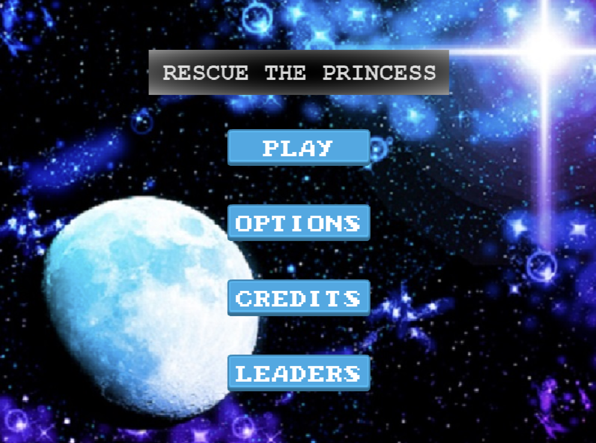
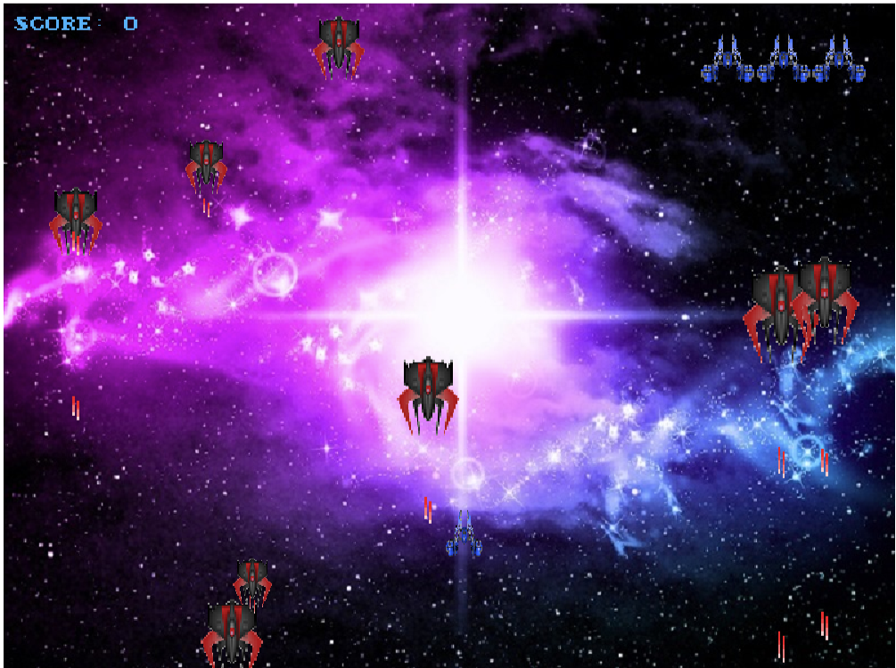

# Rescue The Princess Shooter-Game-JS

>  Shooter game built with Javascript using Phaser and Webpack. Capstone Project for Microverse on the top of my Javascript knowledge.

### Landing Page:



### Stage 1:



## Game Design Document

Kindly check my Game Design Document [GDD](assets/docs/gamedesigndocument.md)

## Built With

- HTML
- JAVASCRIPT
- PHASER 3
- NPM
- WEBPACK
- EXPRESS
- BOOTSTRAP
- JEST
- GITHUB ACTIONS

## Live Demo

[Live Demo Link](https://romantic-goldberg-9d900b.netlify.app/)

## Instructions to Play

- Click the option you want in the Landing Scene.

- Press 'Play' to start playing.

- Press 'Options' to enable/disable sound features.

- Press 'Credits' to see who made it possible.

- Press 'Leaders' to see the 5 best scores.

- To play you need the Keyboard and the Mouse.

- CONTROLS:

  - Press 'A' to move LEFT.

  - Press 'D' to move RIGHT.

  - Press 'W' to move UP.

  - Press 'S' to move DOWN.

  - Press 'SpaceBar' to SHOOT.

- Use the mouse for the non-game and dialogues screens.

- Have Fun Playing!


## Getting Started

### Usage

- Click the Live Demo link and enjoy playing the shooter game.

### Setup

- Clone the repository on your local machine
- Cd into the folder
- Run `npm install`
- Run `npm start`
- On your browser, make sure you point to the right address (i.e: http://localhost:8080/)

### Run tests

- Run ```npm test``` on the root directory to run all the tests.

## Future features

- Add extra stages, weapons and effects.
- Add more enemies
- Add images in the dialogues scenes
- Modify the assets
- Add animations
- Add a pause scene 

## Author

### 1. Witah Georjane
* Github: [@Georjane](https://github.com/Georjane)
* Twitter: [@WittyJany](https://twitter.com/WittyJany)
* LinkedIn: [Witah Georjane](https://www.linkedin.com/in/witah-georjane)

## Contributing
There are two ways of contributing to this project:

1. If you see something wrong or not working, please open the issue in issue section
2. If you see something to improve or to correct, and you have a solution to that, follow the below steps to contribute:
    1. Fork this repository
    2. Clone it on your local computer by running `git clone https://github.com/Georjane/game-with-phaser.git` __Replace *your username* with the username you use on github__
    3. Open the cloned repository which appears as a folder on your local computer with your favorite code editor
    4. Create a separate branch off the *master branch*,
    5. Write your codes which fix the issue you found
    6. Commit and push the branch you created
    7. Open a pull request, comparing your new created branch with our original master branch [here](https://github.com/Georjane/game-with-phaser/pulls)

## Show your support

Give a ⭐️ if you like this project!

## Acknowledgment
* [Microverse](https://www.microvese.org)
* [The Odin Project](https://www.theodinproject.com)
