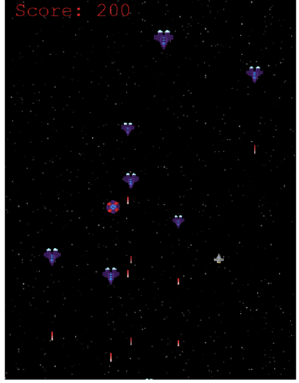

# 


## Requirements

[Node.js](https://nodejs.org) is required to install dependencies and run scripts via `npm`.

## Available Commands

| Command | Description |
|---------|-------------|
| `npm install` | Install project dependencies |
| `npm start` | Build project and open web server running project |
| `npm run build` | Builds code bundle with production settings (minification, uglification, etc..) |

## Writing Code

After cloning the repo, run `npm install` from your project directory. Then, you can start the local development server by running `npm start`.

After starting the development server with `npm start`, you can edit any files in the `src` folder and webpack will automatically recompile and reload your server (available at `http://localhost:8080` by default).

## Customizing the Template

### Webpack

If you want to customize your build, such as adding a new webpack loader or plugin (i.e. for loading CSS or fonts), you can modify the `webpack/base.js` file for cross-project changes, or you can modify and/or create new configuration files and target them in specific npm tasks inside of `package.json'.

## Deploying Code

After you run the `npm run build` command, your code will be built into a single bundle located at `dist/bundle.min.js` along with any other assets you project depended. 

If you put the contents of the `dist` folder in a publicly-accessible location (say something like `http://mycoolserver.com`), you should be able to open `http://mycoolserver.com/index.html` and play your game.


# My Shooter Game with Phaser 3
In this project, I was asked to build a platform game such as the space shooter game. I designed a simple but creative game and implement it using Phaser. 
A user is able to search for a specific location's weather information and toggle displaying the data in Fahrenheit or Celsius.

## ShooterGame Screenshot


## Live Link
- [ShooterGame]()

## Built With
- Phaser 3
- Webpack
- HTML
- JavaScript

## Getting Started
To get a local copy of the repository please run the following commands on your terminal:
```
$ git clone https://github.com/Georjane/game-with-phaser.git
$ cd game-with-phaser
```
Then open index.html file


## Author

### 1. Witah Georjane
* Github: [@Georjane](https://github.com/Georjane)
* Twitter: [@WittyJany](https://twitter.com/WittyJany)
* LinkedIn: [Witah Georjane](https://www.linkedin.com/in/witah-georjane)

## Contributing
There are two ways of contributing to this project:

1. If you see something wrong or not working, please open the issue in issue section
2. If you see something to improve or to correct, and you have a solution to that, follow the below steps to contribute:
    1. Fork this repository
    2. Clone it on your local computer by running `git clone https://github.com/Georjane/game-with-phaser.git` __Replace *your username* with the username you use on github__
    3. Open the cloned repository which appears as a folder on your local computer with your favorite code editor
    4. Create a separate branch off the *master branch*,
    5. Write your codes which fix the issue you found
    6. Commit and push the branch you created
    7. Open a pull request, comparing your new created branch with our original master branch [here](https://github.com/Georjane/game-with-phaser/pulls)

## Show your support

Give a ⭐️ if you like this project!

## Acknowledgment
* [Microverse](https://www.microvese.org)
* [The Odin Project](https://www.theodinproject.com)